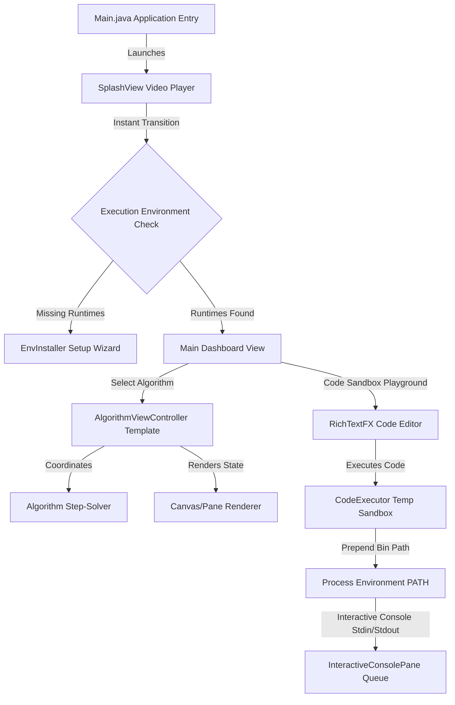

<p align="center">
  
</p>
<h1 align="center">AlgoBuddy: Your Offline Algorithm Playground</h1>
<p align="center">
  <strong>Interactive algorithm visualizer and code sandbox that runs fully local</strong><br/>
  <em>Select an algorithm → watch step-by-step playback → write and execute C/C++/Java/Python code in the sandbox</em>
</p>

<p align="center">
  
  
  
  
  
</p>

---

## Table of Contents

- 🔍 [Overview](#overview)
- 🎯 [Why AlgoBuddy?](#why-algobuddy)
- ✨ [Features](#features)
- 🏗 [Architecture](#architecture)
- 🔄 [Execution Workflow and How It Works](#execution-workflow-and-how-it-works)
- 🎨 [UI Guide](#ui-guide)
  - [Dashboard](#dashboard)
  - [Algorithm Visualizer Pane](#algorithm-visualizer-pane)
  - [Interactive Sandbox Console](#interactive-sandbox-console)
  - [Setup Wizard Installer](#setup-wizard-installer)
- 🚀 [Launch Instructions](#launch-instructions)
  - [Running from Source](#running-from-source)
  - [Release Standalone EXE](#release-standalone-exe)
- 📁 [Project Structure and Key Components](#project-structure-and-key-components)
- ⚠️ [Troubleshooting and Failsafes](#troubleshooting-and-failsafes)
- 👤 [Author](#author)

---

## Overview

**AlgoBuddy** is a premium, offline desktop application designed to bridge the gap between abstract computer science concepts and concrete execution. It functions as both a step-by-step visual debugger for algorithms and an interactive code compilation sandbox.

Watch algorithms execute visually, inspect step-by-step state changes, step backwards/forwards in execution time, and compile your own custom code in **Java, C, C++, or Python** using fully local, bundled compiler runtimes.

---

## Why AlgoBuddy?

> **Traditional algorithm visualizers show static animations of hardcoded logic. AlgoBuddy runs your actual code and compiles custom source scripts, offline.**

| Feature | Traditional Web Visualizers (e.g. VisuAlgo) | AlgoBuddy |
|---|---|---|
| **Code Execution** | Static pseudocode line highlighting only | Compiles & executes custom C/C++/Java/Python source code |
| **Console Sandbox** | None | Interactive stdin/stdout console with yellow blinking prompt |
| **Offline Portability** | Requires active internet access | 100% offline—bundles or downloads local compiler runtimes |
| **Playback Control** | Forward only or simple speed adjustment | Forward, Backward (state restore snapshots), Play/Pause, speed slider |
| **Windows Launcher** | None (browser-based only) | Standalone Launch4j EXE wrapping shaded JAR with embedded JRE |

---

## Features

### 🎬 Step-by-Step Algorithm Visualization
* **Granular Playback**: Play, Pause, Step-Forward, and Step-Backward using state snapshot restore.
* **Variable Tracker**: Inspect stack states, variables, index pointers, and structural metrics in real-time.
* **Adaptive Speed**: Intuitive speed slider to control execution delays dynamically.
* **Rich Animations**: Highlight nodes, pulse edges, shake cycles, and emphasize changes on canvas.

### 💻 Code Compilation Sandbox
* **Offline Compilers**: Bundle-ready local toolchains for GCC (MinGW), JDK (Java), and Python.
* **Interactive Console**: Supports interactive `stdin` inputs using a thread-safe blocking queue.
* **Syntax Highlighting**: Powered by RichTextFX with dynamic token color schemes.
* **Compiler Path Resolution**: Dynamic parent-directory search (up to depth 5) that automatically prepends `bin/` folders to environment `PATH` to resolve GCC sub-process assembler (`as.exe`) errors.

---

## Architecture

AlgoBuddy is structured using a strict **Model-View-Controller-Renderer (MVCR)** architecture:



<details>
<summary>ASCII fallback (click to expand)</summary>

```text
               [Main.java Application Entry]
                             │
                         (Launches)
                             ▼
                 [SplashView Video Player]
                             │
                    (Instant Transition)
                             ▼
             {Execution Environment Check}
                  /                     \
          (Missing Runtimes)       (Runtimes Found)
                /                         \
               ▼                           ▼
    [EnvInstaller Setup Wizard]     [Main Dashboard View]
                                      /           \
                           (Select Alg)          (Run Code Sandbox)
                                  /                     \
                                 ▼                       ▼
                   [AlgorithmViewController]     [RichTextFX Code Editor]
                          /         \                    │
                     (Solver)     (Canvas)          (Executes Code)
                        /             \                  ▼
             [Algorithm Solver]  [Visual Renderer]  [CodeExecutor Temp Sandbox]
                                                         │
                                                 (Prepend bin to PATH)
                                                         ▼
                                                [Interactive Console]
```
</details>

---

## Execution Workflow and How It Works

1. **Startup**: The application launches, instantly showing the `SplashView` video animation running at `1.5x` speed.
2. **Environment Scan**: `ExecutionEnvironment` performs a quick local path query. If local runtimes are missing, the `EnvInstaller` setup wizard pops up to let users download runtimes.
3. **Dashboard / Visualizer Selection**: The user selects an algorithm from the category grid.
4. **Playback Thread Loop**: The `AlgorithmViewController` manages a timeline callback. At each tick, it asks the solver to `step()` once, updates variables, and commands the canvas renderer to draw the current frame.
5. **Snapshot Save/Restore**: To support stepping backwards, each `step()` call takes a clone `snapshot()` of all solver state variables. If the user steps back, the controller restores the solver to a previous state frame.

---

## UI Guide

### Dashboard
The gateway screen containing a category grid (Searching, Sorting, Graphs, Dynamic Programming, Puzzles, etc.) with a live-filtering search bar.

### Algorithm Visualizer Pane
The main visualization panel holding the animation canvas, pseudocode sidebar, playback buttons, variable tracking table, and speed slider.

### Interactive Sandbox Console
A split-screen layout featuring a code editor with line numbers and syntax highlighting alongside a live stdin/stdout terminal panel.

### Setup Wizard Installer
A package downloader wizard with progress bars showing compiler extraction status for GCC (MinGW), Java JDK, and Python.

---

## Launch Instructions

### Running from Source

#### Prerequisites
* **Java Development Kit (JDK) 11** or higher.
* **Apache Maven 3.6+**.

#### Running Console Commands
```bash
# Compile and run JavaFX application
mvn clean compile
mvn javafx:run
```

### Release Standalone EXE
To launch the packaged release version:
1. Double-click the compiled `AlgoBuddy.exe`.
2. The executable runs with its own embedded JRE—no Java installation required!

*Launch4j configurations can be modified locally in `algobuddy.xml`.*

---

## Project Structure and Key Components

| Path | Purpose |
|---|---|
| `src/main/java/com/algorithmvisualizer/Main.java` | App entry point and window manager |
| `src/main/java/com/algorithmvisualizer/execution/ExecutionEnvironment.java` | Scans local folders for compiler runtimes |
| `src/main/java/com/algorithmvisualizer/execution/CodeExecutor.java` | Sandboxes compilation & routes subprocess paths |
| `src/main/java/com/algorithmvisualizer/ui/MainController.java` | Category selection dashboard controller |
| `src/main/java/com/algorithmvisualizer/ui/AlgorithmViewController.java` | Central template for visualizers and playback controls |
| `src/main/java/com/algorithmvisualizer/ui/SplashView.java` | Manages 1.5x sped-up video logo reveal |
| `src/main/java/com/algorithmvisualizer/ui/EnvInstallerController.java` | Setup wizard downloader for compilers |
| `src/main/resources/fxml/` | FXML layout views for all panels |
| `src/main/resources/css/style.css` | Premium styling stylesheets and dark-mode tokens |

---

## Troubleshooting and Failsafes

| Expected Error | Cause | Solution |
|---|---|---|
| `CreateProcess: No such file or directory` (GCC `as` error) | GCC assembler (`as.exe`) missing from environment search path | Handled dynamically by `CodeExecutor` automatically prepending the compiler's `bin/` folder to the runtime process environment `PATH`. |
| `IllegalAccessError` in splash video | `javafx.media` module missing from JRE module path | Fixed in `algobuddy.xml` by adding `javafx.media` to the `--add-modules` Launch4j compiler options. |
| `ZipException` during installation | ZIP extraction fails due to central directory header mismatches | Resolved by using random-access `ZipFile` parser instead of sequential `ZipInputStream`. |
| Missing local runtimes | Runtimes not downloaded or placed in directory root | Run the built-in Setup Wizard installer to download and unpack compilers automatically. |

### Failsafes
* **Code Execution Sandbox**: Limits running processes to a maximum 10-second timeout to prevent infinite loops.
* **Codec Fallback**: If media engines or codecs are missing, the splash view catches exceptions and falls back to loading the dashboard immediately.

---

## Author

<p align="center">
  <strong>Felix Au</strong><br/>
  <a href="https://github.com/Felix-au">GitHub Profile</a> | <a href="mailto:felix.au@example.com">Email Address</a>
</p>

<p align="center"><sub>Interactive learning that brings code to life, offline.</sub></p>
